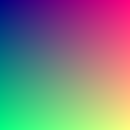
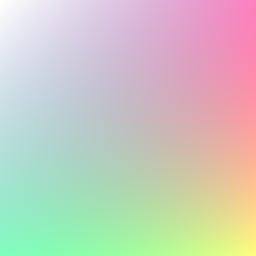

# svpng v0.1.1

A minimalistic C function for saving RGB/RGBA image into uncompressed PNG.

Copyright (C) 2017 Milo Yip. All rights reserved.

# Features

* RGB or RGBA color format
* Single function
* 32 lines of ANSI C code
* No dependency
* Customizable output stream (default with C file descriptor)

# Usage

By default, `svpng()` function has the following declaration:

~~~c
/*!
    \brief Save a RGB/RGBA image in PNG format.
    \param out Output stream (by default using file descriptor).
    \param w Width of the image. (<16383)
    \param h Height of the image.
    \param img Image pixel data in 24-bit RGB or 32-bit RGBA format.
    \param alpha Whether the image contains alpha channel.
*/
void svpng(FILE* out, unsigned w, unsigned h, const unsigned char* img, int alpha);
~~~

Basically, you `fopen()` a binary file for writing, then call this function with the image data. The pixels are packed linearly from top to bottom, left to right.

For 24-bit RGB format (with `alpha = 0`), the R, G, B components are stored in `img[(y * w + x) * 3]`, `img[(y * w + x) * 3 + 1]`, `img[(y * w + x) * 3 + 2]` respectively.

For 32-bit RGBA format  (with `alpha != 0`), the R, G, B, A components are stored in `img[(y * w + x) * 4]`, `img[(y * w + x) * 4 + 1]`, `img[(y * w + x) * 4 + 2]`, `img[(y * w + x) * 4 + 3]` respectively.

## Example

[example.c](example.c) saves a RGB and a RGBA PNG.

~~~c
void test_rgb(void) {
    unsigned char rgb[256 * 256 * 3], *p = rgb;
    unsigned x, y;
    FILE *fp = fopen("rgb.png", "wb");
    for (y = 0; y < 256; y++)
        for (x = 0; x < 256; x++) {
            *p++ = (unsigned char)x;    /* R */
            *p++ = (unsigned char)y;    /* G */
            *p++ = 128;                 /* B */
        }
    svpng(fp, 256, 256, rgb, 0);
    fclose(fp);
}

void test_rgba(void) {
    unsigned char rgba[256 * 256 * 4], *p = rgba;
    unsigned x, y;
    FILE* fp = fopen("rgba.png", "wb");
    for (y = 0; y < 256; y++)
        for (x = 0; x < 256; x++) {
            *p++ = (unsigned char)x;                /* R */
            *p++ = (unsigned char)y;                /* G */
            *p++ = 128;                             /* B */
            *p++ = (unsigned char)((x + y) / 2);    /* A */
        }
    svpng(fp, 256, 256, rgba, 1);
    fclose(fp);
}

int main(void) {
    test_rgb();
    test_rgba();
    return 0;
}
~~~

## Compilation

~~~
gcc example.c && ./a.out
~~~

## Output

# Customizability

User can define the following macros before including `svpng.inc`.

| Macro           | Default         | Description |
|-----------------|-----------------|-------------|
| `SVPNG_LINKAGE` | (empty)         | Linkage of `svpng()` function, e.g. `inline`, `static`, `extern "C"`, etc. |
| `SVPNG_OUTPUT`  | `FILE* out`     | Output stream parameter, e.g. `std::ostream& os`, `std::vector<std::uint8_t>& buffer`, etc. |
| `SVPNG_PUT(u)`  | `fputc(u, out)` | Output a byte into stream, e.g. `os.put(u)`, `buffer.push_back(u)`, etc. |
